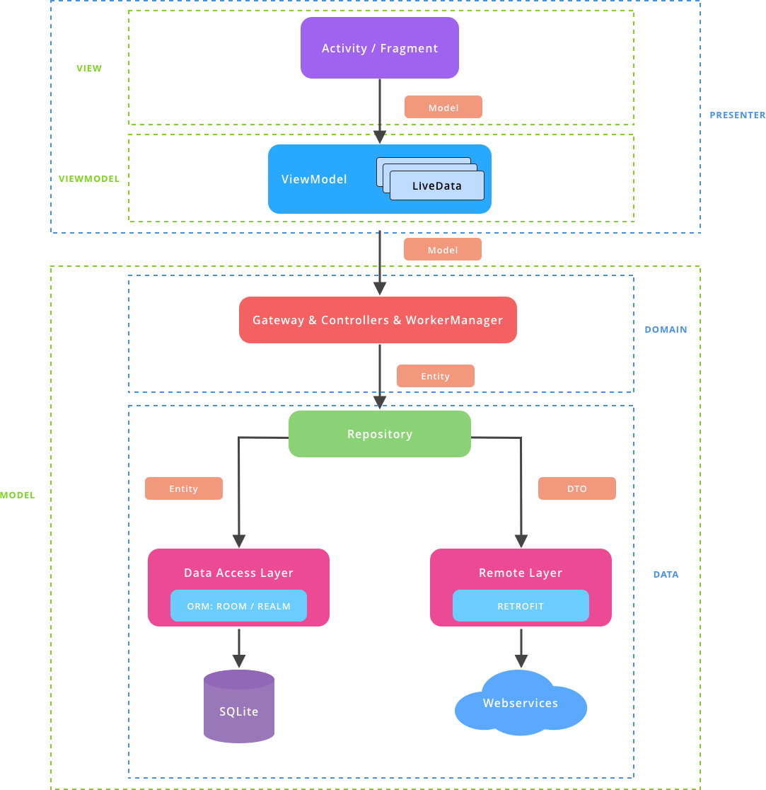

# Project Architecture
---------------------------

<h3 align="center">
    
</h3>

# Project Structure
---------------------------

The project should maintain the following structure:

	src/data
	src/domain
	src/presentation

## 1. data
The data package contains any classes (and child packages) that are directly related to any kind of data or data management used within the app — be it networking classes and interfaces, preferences management, database classes, data models, network request and response model, or anything else directly tied to app data. Within this package we also have child packages that are organized per-type.

	src/data/local
	src/data/remote
	src/data/repository
	
	
**local** - The local package contains all of the classes that deal with data being persisted locally to the application. 

	src/data/local/converter
	src/data/local/dao
	src/data/local/database
	src/data/local/entity
	src/data/local/sharedPreference	
	
**remote** - The Remote package contains the implementation for the remote data source.
	
	src/data/remote/model
	src/data/remote/api
	
**repository** - The Repository package contains the classes or components that encapsulate the logic required to access data sources.

	
## 2. domain
The Domain layer contains the business logic, controllers and the models that define the entities used within the app. Within this package we also have child packages that are organized per-type.

	src/domain/gateway
	src/domain/controller
	src/domain/model
	
	
## 3. presentation
The presentation package is responsible for holding any classes that are related to the UI components of the application. Within this package we also have child packages that are organized per-feature.

	src/presentation/di
	src/presentation/ui
	src/presentation/utils

**di** - The injection package holds all of our dependency injection classes.

	src/presentation/di/base
	src/presentation/di/module
	src/presentation/di/component
		
**ui** - Contains all of UI related components — such as Views, Activities, Fragments, ViewModels, etc. 

	src/presentation/ui/base
	src/presentation/ui/common
	src/presentation/ui/featureX
	
**base** - The base package is used to hold any base classes that can be extended by other classes within the UI package. For example, we have BaseActivity and BaseFragment classes which are used to hold common logic for the activities and fragment used by our app, meaning we don’t have to repeat the same code over and over for each new activity or fragment that we create.

**common** - The common package is used to hold any classes that may be used across the different features within the UI package. For example, we have general ErrorView and RefreshingView classes that are shared across several different screens, so placing this inside a common package feels natural.

**feature** - The feature package is used to hold any classes related to a feature. Within this package we also have child packages that are organized per-type.

# Project Guidelines
---------------------------

## 1. File Naming

### 1.2 Class Files

Any classes that you define should be named using UpperCamelCase, for example:

	AndroidActivity, NetworkHelper, UserFragment, PerActivity

Any classes extending an Android framework component should **always** end with the component name. For example:

	UserFragment, SignUpActivity, RateAppDialog, PushNotificationServer, NumberView

### 1.3 Resource Files

When naming resource files you should be sure to name them using lowercase letters and underscores instead of spaces, for example:

	activity_main, fragment_user, item_post

This convention again makes it really easy to locate the specific layout file that you're looking for. Within android studio, the layout package is sorted in alphabetical order meaning that activity, fragment and other layout types becomes grouped - so you know where to begin looking for a file. Other than this, beginning the file name with the component name makes it clear what component/class the layout file is being used for.

### 1.4 Drawable Files

Drawable resource files should be named using the **ic_** prefix along with the size and color of the asset. For example, white accept icon sized at 24dp would be named:

	ic_accept_24dp_white

And a black cancel icon sized at 48dp would be named:

	ic_cancel_48dp_black

We use this naming convention so that a drawable file is recognisable by its name. 

Other drawable files should be named using the corresponding prefix, for example:

| Type       | Prefix    | Example                |
|------------|-----------|------------------------|
| Selector   | selector_ | selector_button_cancel |
| Background | bg_       | bg_rounded_button      |
| Circle     | circle_   | circle_white           |
| Progress   | progress_ | progress_circle_purple |
| Divider    | divider_  | divider_grey           |

When creating selector state resources, they should be named using the corresponding suffix:

| State    | Suffix    | Example             |
|----------|-----------|---------------------|
| Normal   | _normal   | btn_accept_normal   |
| Pressed  | _pressed  | btn_accept_pressed  |
| Focused  | _focused  | btn_accept_focused  |
| Disabled | _disabled | btn_accept_disabled |
| Selected | _selected | btn_accept_selected |

Using clear prefixes such as the above helps to make it absolutely obvious as to what a selector state resource is used for.

### 1.5 Layout Files

When naming layout files, they should be named starting with the name of the Android Component that they have been created for. For example:

| Component        | Class Name      | Layout Name       |
|------------------|-----------------|-------------------|
| Activity         | MainActivity    | activity_main     |
| Fragment         | MainFragment    | fragment_main     |
| Dialog           | RateDialog      | dialog_rate       |
| Widget           | UserProfileView | view_user_profile |
| AdapterView Item | N/A             | item_follower     |

**Note:** If you create a layout using the merge tag then the layout_ prefix should be used.

### 1.6 Menu Files

Menu files do not need to be prefixed with the menu_ prefix. This is because they are already in the menu package in the resources directory, so it is not a requirement.

### 1.7 Values Files

Resources should be split up into the following key files and folders:

| Name         | Path                      | Description |
| --------     | -----------               | ----------- |
| XML Layouts  | `res/layout/`             | This is where we put our XML layout files.     |
| XML Menus    | `res/menu/`               | This is where we put our AppBar menu actions.  |
| Drawables    | `res/drawable`            | This is where we put images and XML drawables. | 
| Colors       | `res/values/colors.xml`   | This is where we put [color definitions](http://developer.android.com/guide/topics/resources/more-resources.html#Color). |
| Dimensions   | `res/values/dimens.xml`   | This is where we put [dimension values](http://developer.android.com/guide/topics/resources/more-resources.html#Dimension). | 
| Strings      | `res/values/strings.xml`  | This is where we put strings.           |
| Styles       | `res/values/styles.xml`   | This is where we put style values.      |
| Styles       | `res/values/attrs.xml`   | This is where we define custom attributes.      |

